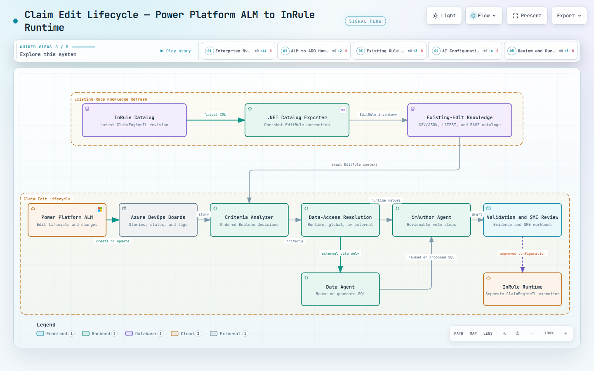

# InRule Data Agent

Generates parameterized SQL queries (QueryText + QueryParams) for InRule pharmacy claim-edit rules.

Part of a two-agent pipeline: the **Criteria Analyzer** (another team) breaks ADO rule logic into steps and flags which steps need data queries. This agent handles those steps.

## How it works

```
Criteria Analyzer output (requires_data_query = true steps)
    ↓
POST /generate_query_params
    { "dataQueryName": "DiagnosisRequired", "businessMeaning": "...", "environment": "prod" }
    ↓
{ "sourceTemplate": "...", "columnI": "<QueryText>", "columnJ": "<QueryParams JSON>", "validation": {...} }
```

- `dataQueryName` — authoritative name from Column H of the ground truth spreadsheet
- `businessMeaning` — plain-English step description from Criteria Analyzer output

## Layout

```
src/inrules_data_agent/
├── app.py                  FastAPI app — /health + /generate_query_params
├── partb/generate.py       Core logic: dataQueryName → template → QueryText + QueryParams
├── registry/               Template provider + runtime variable registry
├── fixtures/templates/     Named SQL templates (JSON)
├── validate/               S2 placeholder/param validation
├── catalog/                Schema catalog from DDL files
└── llm/                    OpenAI client (reserved for future LLM path)

cc-bridge/
├── ARCHITECTURE.md         Architecture reference — read this first
├── groundtruth_spreadsheet_export.json
└── derived_schema_ddls/    Real table schemas
```

## Running locally

```bash
cd inrules-data-agent
uv run uvicorn inrules_data_agent.app:app --app-dir src --reload
```

Health check: `GET /health`

## Query generation providers

`ENVIRONMENT` is required and matched case-insensitively. It selects the query-generation
provider; request jurisdiction selects the Bedrock project where applicable.

| `ENVIRONMENT` | Provider | Jurisdictions | Runtime restriction |
| --- | --- | --- | --- |
| `LOCAL` | OpenAI-compatible | IL only | Prohibited in Kubernetes |
| `DEV` | Bedrock | IL and MO | Deployed environments only |
| `SIT` | Bedrock | IL and MO | Deployed environments only |
| `UAT` | Bedrock | IL and MO | Deployed environments only |
| `PROD` | Bedrock | IL and MO | Deployed environments only |

For `LOCAL`, set `OPENAI_API_KEY`. `OPENAI_MODEL`, `OPENAI_BASE_URL` (or the legacy
`OPENAI_API_BASE`), `OPENAI_TIMEOUT_SECONDS`, and `OPENAI_VERIFY_SSL` may override their
built-in defaults. LOCAL requests fail closed for MO and whenever
`KUBERNETES_SERVICE_HOST` indicates Kubernetes.

For Bedrock environments, set `BEDROCK_PROJECT_IL` for IL requests and
`BEDROCK_PROJECT_MO` for MO requests; each jurisdiction requires its own project.
`BEDROCK_MODEL` and `BEDROCK_REGION` select the model and AWS region, with defaults of
`openai.gpt-5.5` and `us-east-1`. Missing or unsupported `ENVIRONMENT` values fail closed,
as does a request whose jurisdiction-specific Bedrock project is not configured.

Example local configuration (placeholder values only):

```dotenv
ENVIRONMENT=LOCAL
OPENAI_API_KEY=your-local-api-key
OPENAI_MODEL=your-openai-compatible-model
OPENAI_BASE_URL=https://your-openai-compatible-endpoint.example/v1
```

Example deployed configuration (placeholder values only):

```dotenv
ENVIRONMENT=DEV
BEDROCK_MODEL=your-bedrock-model
BEDROCK_REGION=your-aws-region
BEDROCK_PROJECT_IL=your-il-project-id
BEDROCK_PROJECT_MO=your-mo-project-id
```

Provider calls are mocked in unit tests; a live SIT or UAT smoke test is still required
before relying on deployed provider connectivity.

## Architecture reference

The Claim Edit lifecycle architecture is included below for GitHub and documentation readers:



The image is documentation only. It is not part of the deployed application and is not required at runtime.

## Local DataQuery reuse catalog

Reuse matching reads a local, read-only SQLite catalog first. This lets normal
ADO/Data Agent runs validate exact reusable DataQuery templates without SQL
Server credentials or a live ClaimEngine connection.

```text
ADO request → local SQLite catalog → deterministic reuse match
```

The catalog contains approved QueryText templates and DataPackage assignment
metadata only; it does not contain claims, members, PHI, credentials, or live
claim data. If no valid local catalog is available, the agent preserves the
existing ClaimEngine lookup fallback. If both sources are unavailable, the API
returns `REUSE_VALIDATION_UNAVAILABLE` rather than claiming a new query is not
reusable.

A controlled user with ClaimEngine access creates the initial static catalog:

```bash
PYTHONPATH=src python scripts/export_dataquery_catalog.py
```

The default output is:

```text
src/inrules_data_agent/retrieval/data/dataquery_reuse_catalog.sqlite3
```

To use a catalog stored elsewhere, set:

```text
DATAQUERY_CATALOG_PATH=C:\path\dataquery_reuse_catalog.sqlite3
```

Catalog export is an explicit maintenance command. It never runs during API
startup or for an individual ADO request.

## Semantic query hints

The packaged catalog at `src/inrules_data_agent/semantic_query_hints/concepts.v1.yaml`
is enabled by default. All requirement-derived required phrases must match the
authoritative atomic business meaning. Zero or multiple matching concepts, disabled or
invalid configuration, and an invalid catalog safely omit the supplemental hint.

## Tests

Install the project and development tools with `uv`:

```bash
uv sync --all-groups
```

Run the complete backend suite:

```bash
uv run poe test
```

Run the focused fast suite for query generation and deterministic reuse matching:

```bash
uv run poe test-fast
```

Run only query-generation tests:

```bash
uv run poe test-query-generation
```

Run only SQLite-catalog and deterministic reuse tests:

```bash
uv run poe test-query-reuse
```

The upcoming SQL-accuracy regression suite will add the review-workbook issues as permanent test cases. New Data Agent SQL-generation changes must pass the complete suite before they are accepted.
