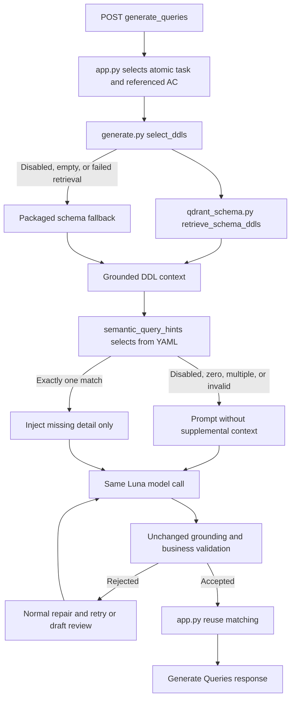

# Semantic Query Hints

## Purpose and status

Semantic query hints are a small, default-on pilot. They fill an important business
detail that is missing from an otherwise compatible atomic query instruction. Selection does not
approve generated SQL, and the existing SQL validators remain authoritative.

Implementation:

- [`semantic_query_hints/__init__.py`](src/inrules_data_agent/semantic_query_hints/__init__.py)
- [`semantic_query_hints/concepts.v1.yaml`](src/inrules_data_agent/semantic_query_hints/concepts.v1.yaml)
- [`generator/generate.py`](src/inrules_data_agent/generator/generate.py)

## 7046 example concept

Applicability comes only from exact requirement wording recorded as
`applies_when.required_phrases`:

- `other payer reject code`
- `valid ncpdp reject code`

The SME supplies only `semantic_hint.missing_detail`:

> When validating the reject-code record, also require the date of service to fall
> inclusively within that record's effective and term dates.

The missing detail intentionally does not prescribe a table, column, runtime parameter,
collection, history policy, output, query shape, or row-selection policy. Those remain
part of the current request context and DataQuery contract.

## Runtime flow

### File-by-file walkthrough

1. **Request models and endpoint — `backend/src/inrules_data_agent/app.py`.** `Step`
   carries the per-step `business_meaning`, `requires_data_query`, and optional result
   shape. `GenerateQueriesRequest` carries the Edit ID, overall description, acceptance
   criteria, steps, and generation mode. POST `/generate_queries` passes the validated
   request to `build_generate_queries_response`.

2. **Atomic task and referenced AC — `app.py`.** For each required step,
   `_query_task_for_step` chooses the routed atomic retrieval instruction when one exists,
   while retaining the step's business-fact constraints and result shape; otherwise it
   uses the step business meaning. This final query task is the authoritative atomic
   business meaning passed into generation. `_acceptance_criteria_for_step` passes a
   scalar AC unchanged, but when AC is a list it includes only entries explicitly named
   by the step's `ado_criterion_ref`. The description remains overall supporting context.
   Semantic selection receives the final query task, never `edit_id`, so a concept is
   reusable across compatible Edit IDs.

3. **Generation and DDL grounding — `backend/src/inrules_data_agent/generator/generate.py`.**
   `generate_query_result_for_step` calls `select_ddls` with the authoritative query task,
   description, and selected AC. `select_ddls` asks
   `backend/src/inrules_data_agent/retrieval/qdrant_schema.py` for
   `retrieve_schema_ddls` results when Qdrant retrieval is enabled. If retrieval is
   disabled, returns no DDL, or raises an error, `select_ddls` orchestrates the fallback
   by loading the complete packaged InMemory and physical schema catalogs; it can also
   append keyword-selected live schema definitions. `retrieve_schema_ddls` itself does
   not perform that packaged fallback.

   DDL grounding means relevant schema definitions are supplied to Luna and later used
   to check whether generated tables and columns exist. It is schema evidence, not final
   business approval: it does not prove that outputs, predicates, relationships,
   effective windows, or other business behavior are correct.

4. **Catalog loading and deterministic selection —
   `backend/src/inrules_data_agent/semantic_query_hints/__init__.py`. `_configured`
   reads the enable/disable setting. `load_semantic_hints` loads and validates packaged
   `concepts.v1.yaml`. `_normalize` lowercases and keeps alphanumeric tokens, and
   `_contains_phrase` requires each normalized phrase to be contiguous. The selector
   does not infer arbitrary synonyms or use semantic similarity.

   `select_semantic_hint` checks only the final query task/business meaning. Every
   `applies_when.required_phrases` entry must match for a concept to apply. Zero matches
   return `no_match`; exactly one returns `selected`; multiple full matches return
   `ambiguous`. Disabled, invalid-configuration, and invalid-catalog paths also select
   nothing. All of those non-selected outcomes inject nothing.

5. **YAML boundary —
   `backend/src/inrules_data_agent/semantic_query_hints/concepts.v1.yaml`.** Applicability
   phrases, concept identity, and provenance stay local. YAML provenance, concept ID,
   required phrases, table or column information, and SQL are not copied into the model
   prompt. Only the selected `semantic_hint.missing_detail` is eligible for injection.

6. **Prompt assembly — `generate.py` `_build_user_message`.** The user message order is
   fixed:

   1. DDL schemas;
   2. rule description;
   3. `SUPPLEMENTAL SEMANTIC CONTEXT` only when exactly one concept is selected;
   4. directly referenced acceptance criteria; and
   5. current Data Query business meaning, last and authoritative.

   An explicit non-override boundary immediately precedes the supplemental section. The
   labeled section itself contains only the selected `missing_detail`. The hint may fill an
   omitted compatible detail, but it cannot choose tables, columns, outputs, runtime inputs,
   joins, query shape, or row-selection policy. `_build_user_message` then calls
   `log_semantic_hint_decision` with selection and injection metadata.

7. **Luna call — `generate.py` `_call_openai`.** `_call_openai` combines the shared system
   prompt with the assembled user message and any normal repair feedback, then calls the
   configured model using the structured `query_text` JSON contract. Semantic hints do
   not create a separate model path or alter the prompt hierarchy.

8. **Validation and retries — `generate.py` `generate_query_result_for_step`.** Each
   candidate passes safe-SELECT parsing, table and column grounding, SQL-artifact checks,
   output checks, deterministic-selection checks, and business checks. In particular,
   `_find_required_business_concept_artifacts` checks for omitted strongly named atomic
   requirements. A strict-mode failure is summarized by the generic
   `_build_artifact_repair_feedback` and follows the normal retry loop. Draft mode keeps
   its existing review-only behavior for safe grounded candidates. Semantic selection
   never approves SQL and does not weaken either mode.

9. **Reuse and response — `app.py` and
   `backend/src/inrules_data_agent/retrieval/querytext_shadow.py`.** Only after generation
   returns accepted SQL does `build_generate_queries_response` call `find_reuse_match`
   against the loaded reuse corpus. Reuse matching canonicalizes source, predicates,
   projection, and parameter bindings; it is not part of semantic selection or SQL
   validation. The app then returns the generated status and attempts plus either a reuse
   contract, a proposed new Data Query contract, or a not-generated decision.

### Files to open during a walkthrough

| File | Presenter focus |
|---|---|
| `backend/src/inrules_data_agent/app.py` | `Step`, `GenerateQueriesRequest`, POST `/generate_queries`, task/AC selection, reuse, response |
| `backend/src/inrules_data_agent/generator/generate.py` | generation loop, `select_ddls`, prompt assembly, Luna call, validators, repair feedback |
| `backend/src/inrules_data_agent/retrieval/qdrant_schema.py` | optional `retrieve_schema_ddls`; packaged fallback remains in `select_ddls` |
| `backend/src/inrules_data_agent/semantic_query_hints/__init__.py` | configuration, YAML loading, normalization, exact matching, decision logging |
| `backend/src/inrules_data_agent/semantic_query_hints/concepts.v1.yaml` | local applicability/provenance and the only prompt-eligible field, `missing_detail` |
| `backend/src/inrules_data_agent/retrieval/querytext_shadow.py` | post-validation `find_reuse_match` and reusable Data Query contract binding |

## Limits of A/B evidence

A controlled A/B run can keep description, referenced acceptance criteria, authoritative
business meaning, grounded DDL, model configuration, retry limits, and validators the same,
while changing only whether semantic-hint selection and injection are enabled. That supports
the narrow claim that the hint was the sole intentional input difference.

Luna remains nondeterministic. Formatting, aliases, retry count, and even broader output
choices can differ for reasons unrelated to the hint. A comparison must therefore report
all attempts and assess source, output contract, and broad query structure. If the runs are
not comparable, or if unchanged validators lead both runs to the same final contract, the
experiment must not be presented as proof that the hint caused a particular SQL difference.

## Implemented 7528 pilot concept

`icd10-four-character-reference-match` v1.0.0 is active in `concepts.v1.yaml` as an
implemented pilot concept. It is ground-truth-backed and still requires formal SME
confirmation.

The injected business fact is:

> When validating an ICD-10 diagnosis code, match using its first four characters rather
> than requiring exact full-code equality.

The concept is reusable across compatible ICD-10 diagnosis-reference validation scenarios.
Edit ID 7528 is provenance and review context only; it is not a runtime trigger and does
not occur in production source. Selection uses these four required phrases:

- `diagnosis code`
- `icd-10`
- `matching`
- `reference`

The selector lowercases text, tokenizes it to alphanumeric words, and requires every phrase
to occur contiguously in the normalized authoritative business meaning. Thus
`diagnosis-code` matches `diagnosis code` and `ICD-10` normalizes to `icd 10`, but the
selector does not infer synonyms, reordered phrase tokens, or alternative patterns. No
alternative-pattern framework is implemented.

The duplicated global first-four-character/exact-equality business rule was removed from
`SYSTEM_PROMPT`. The independent ICD validator remains in place, as do the global IPA
source, ICD version, and inclusive effective-date requirements. Validator knowledge can
cause final no-hint and hint SQL to converge after retries, so first model attempts remain
relevant evaluation evidence. They still do not prove that any individual difference was
caused by the hint.

## Prompt boundary

A semantic hint may fill only an omitted, compatible detail. Explicit current business
meaning, applicable acceptance criteria, and description always win. A hint cannot
replace explicit runtime mapping, output, constants, query need, filters, query
structure, or selection policy.

Only `missing_detail` is sent to Luna. Applicability and provenance remain in YAML and
are not placed in the prompt.

## Configuration and logging

`SEMANTIC_QUERY_HINTS_ENABLED` defaults to `true`. Recognized false values disable the
feature. An invalid value records `invalid_configuration` and safely omits a hint.
Packaged-resource read errors, YAML parse errors, and catalog schema-validation errors
record `invalid_catalog` and also continue with the baseline prompt. Failed loads do not
populate the catalog cache. Matching is deterministic and local and makes no external
model call.

Each prompt-building attempt emits a `semantic_hint_decision` production log event containing only:

- `semantic_mode_enabled`;
- `semantic_concept_id` and `semantic_concept_version`;
- `semantic_decision_reason`, `semantic_configuration_error`, and
  `semantic_catalog_error_type`;
- `semantic_matched_required_phrases` (business-language catalog phrases, not the raw
  business meaning);
- `semantic_hint_hash` and `semantic_hint_length`;
- `semantic_hint_injected`; and
- `semantic_context_section` (`SUPPLEMENTAL SEMANTIC CONTEXT` when injected) and
  `semantic_injection_position`
  (`before_acceptance_criteria_and_authoritative_business_meaning` when injected).

These fields prove deterministic concept selection, whether the hint was actually
appended, and its location relative to acceptance criteria and authoritative business
meaning. Disabled, no-match, invalid-configuration, and invalid-catalog decisions record
`semantic_hint_injected=false` with no section or position.

The production event does not log the missing detail, provenance, prompts, DDL, raw
business meaning, acceptance criteria, description, workbook data, evidence excerpts,
model inputs, or SQL. A controlled demonstration workbook may show paired generated SQL.
Production logs intentionally use SQL hashes and status in their existing result logging rather than
raw SQL. The static missing detail can be read from the packaged YAML catalog or the
source Excel workbook when authorized; it is intentionally absent from production logs.

## Glossary

- **Authoritative business meaning**: the atomic `business_meaning` used for
  applicability and query generation.
- **Required phrases**: exact requirement-derived wording that must all occur
  contiguously after normalization.
- **Missing detail**: the SME-derived clarification eligible for bounded prompt
  injection after applicability is established.
- **Provenance**: workbook references showing where applicability or the missing detail
  originated; it is never prompt content.
- **Corroboration**: an additional source supporting the missing detail.

## Future concepts

A future hint may include physical details only when an SME explicitly confirms them.
Such a concept would require a separately designed grounding mechanism before use;
physical grounding is not implemented in this pilot. Additions should remain compact,
evidence-backed, source-neutral unless physical facts are confirmed, and covered by
focused recognition, prompt-boundary, logging, and generation tests.
